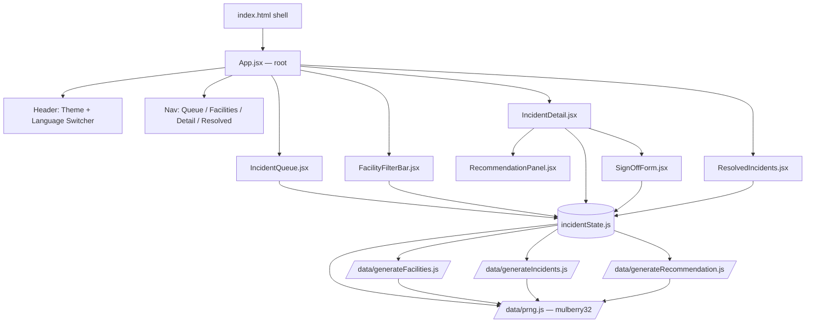
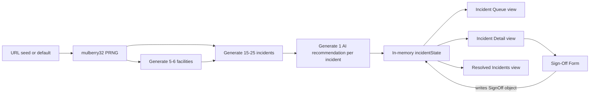
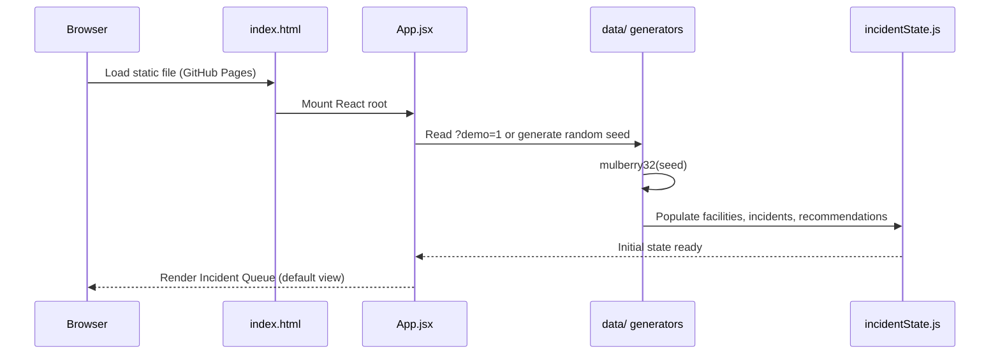

# ARCHITECTURE.md — HealthNexus Command Center

**Day 52 of 60 · System Design**
Source of truth: `PRD.md` and `Implementation Blueprint (Days 52-60)` from Day 51. This document does not redesign the approved scope — it makes it buildable.

## 1. Architecture Summary

HealthNexus Command Center is a **fully client-side, offline-first single-page application**. There is no server, no database, and no network call in the v1.0 critical path. This is not a simplification for the demo — it is the approved v1.0 architecture (PRD §4.2, Out of Scope: "Real backend, database, or persistent multi-user storage").

All "backend" behavior — incident generation, AI recommendation drafting, and sign-off state transitions — happens inside the browser, backed by a seeded synthetic data engine. The "AI recommendation" is a deterministic rule-based generator in v1.0, not a live model call, so the tool works fully offline and reproducibly under `?demo=1`.

## 2. Component Diagram

## 3. Data Flow

Every arrow above is an in-memory function call or React state update. Nothing crosses a network boundary in v1.0.

## 4. Request Lifecycle (Page Load → First Render)

There is no loading spinner state in v1.0 beyond font/asset paint, since generation is synchronous and sub-50ms for 15-25 incidents.

## 5. AI Interaction (v1.0 Scope)

The "AI Advisor" in v1.0 is a **deterministic, rule-based recommendation generator** (`generateRecommendation.js`), not a live LLM call. It maps an incident's type and severity tier to a templated recommended action, a rationale string, and a fixed "Awaiting Clinician Review" status. This is intentional:

- It keeps the tool fully offline and reproducible under `?demo=1` (PRD F9, F12).
- It keeps the governance story honest: v1.0 demonstrates the **workflow and the sign-off gate**, not a production ML model.

**Future scope (post-v1.0):** the same interface (`generateRecommendation(incident) -> Recommendation`) can be swapped for a real Claude API call with no change to any consuming component, since `RecommendationPanel.jsx` only depends on the `Recommendation` shape, not on how it was produced.

## 6. External Services

| Service | Used in v1.0? | Purpose |
|---|---|---|
| GitHub Pages | Yes | Static hosting for the deployed build |
| Claude API | No (future scope) | Would replace the synthetic recommendation generator post-v1.0 |
| Real EHR / incident-reporting systems | No (explicitly out of scope, PRD §4.2) | Future integration point only |

## 7. Conflict Check Against Day 51 PRD/Blueprint

No conflicts found. The Day 51 Blueprint already specified an offline, seeded-data, no-backend architecture (Days 52-53 sections). This document operationalizes that decision into diagrams and does not change scope.
