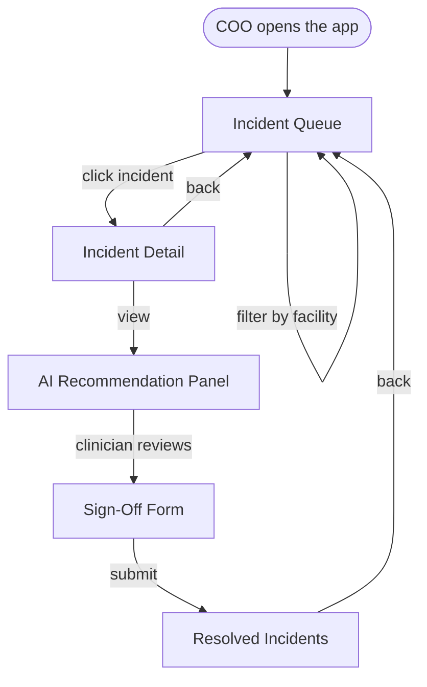

# UI-WIREFRAMES.md — HealthNexus Command Center

**Day 52 of 60 · System Design**

## 1. User Flow Diagram



Every screen exists to answer one question in the COO's triage session: **what's open, what does it need, who decided, and where's the record.**

## 2. Screen Flow

1. **Incident Queue** (default landing screen)
2. **Incident Detail** (reached only from the queue, never a direct deep link in v1.0)
3. **Sign-Off Form** (reached only from within Incident Detail, only when a recommendation exists and no sign-off yet)
4. **Resolved Incidents** (reached from the nav, independent of any specific incident)

## 3. Low-Fidelity Wireframes

### 3.1 Incident Queue

```
┌──────────────────────────────────────────────────────┐
│ HealthNexus Command Center      [Navy|Teal|Gold] [EN|AR] │
├──────────────────────────────────────────────────────┤
│ [All Facilities ▾]                                    │
│ ┌───────────────┬───────────────┬───────────────┐    │
│ │ Total: 19     │ High Risk: 3  │ Elevated: 5   │    │
│ └───────────────┴───────────────┴───────────────┘    │
│ ┌────────────────────────────────────────────────┐   │
│ │ [High Risk] Facility C · Mortality Index        │   │
│ │ "Mortality index breach in ICU..."          →   │   │
│ ├────────────────────────────────────────────────┤   │
│ │ [Elevated] Facility A · Sentinel Event          │   │
│ │ "Sentinel event under review in L&D..."     →   │   │
│ ├────────────────────────────────────────────────┤   │
│ │ [Moderate] Facility B · Infection Rate          │   │
│ │ "Infection rate trending up in Med-Surg..." →   │   │
│ └────────────────────────────────────────────────┘   │
└──────────────────────────────────────────────────────┘
```

### 3.2 Incident Detail (with Recommendation Panel)

```
┌──────────────────────────────────────────────────────┐
│ ← Back to Queue                                       │
│ [High Risk] Facility C — ICU — Mortality Index         │
│ "Full narrative describing the incident..."            │
│ Trend: up from Moderate 6 hours ago                    │
│ ┌────────────────────────────────────────────────┐    │
│ │ ⚠ AI RECOMMENDATION — Awaiting Clinician Review │    │
│ │ Recommended: Escalate to rapid-response team    │    │
│ │ Rationale: "..."                                │    │
│ │ This is an AI-generated recommendation and      │    │
│ │ requires clinician review before any action.    │    │
│ └────────────────────────────────────────────────┘    │
│ [ Complete Sign-Off ]                                  │
└──────────────────────────────────────────────────────┘
```

### 3.3 Sign-Off Form

```
┌──────────────────────────────────────────────────────┐
│ Clinician Sign-Off                                     │
│ Signer Name:  [______________________]                 │
│ Signer Role:  [______________________]                 │
│ Decision:     ( ) Accept  ( ) Modify  ( ) Reject        │
│ Note (required if not Accept): [________________]      │
│                                     [ Submit Sign-Off ] │
└──────────────────────────────────────────────────────┘
```

### 3.4 Resolved Incidents

```
┌──────────────────────────────────────────────────────┐
│ Resolved Incidents                                     │
│ ┌────────────────────────────────────────────────┐    │
│ │ Facility C — Mortality Index         ⚠ Divergent│    │
│ │ AI Recommended: Escalate to rapid-response       │    │
│ │ Clinician Decided: Modified — "..."              │    │
│ │ Signed: Dr. R. Aziz, CMO — 2h ago                │    │
│ └────────────────────────────────────────────────┘    │
└──────────────────────────────────────────────────────┘
```

## 4. Navigation

A single top nav switches between **Queue** and **Resolved**. Detail and Sign-Off are always reached by drilling in, never top-level nav items — this keeps the COO's mental model to "what's active" vs. "what's closed," matching the PRD's core workflow framing (incident triage, not a general-purpose records browser).

## 5. Wireframe-to-Component Mapping

| Wireframe | Component (from Day 51 Blueprint) |
|---|---|
| Incident Queue | `IncidentQueue.jsx` + `SummaryStrip.jsx` + `FacilityFilterBar.jsx` |
| Incident Detail | `IncidentDetail.jsx` |
| Recommendation Panel | `RecommendationPanel.jsx` |
| Sign-Off Form | `SignOffForm.jsx` |
| Resolved Incidents | `ResolvedIncidents.jsx` |

No new components are introduced today. This confirms the Day 51 Blueprint's component list was already correct.
