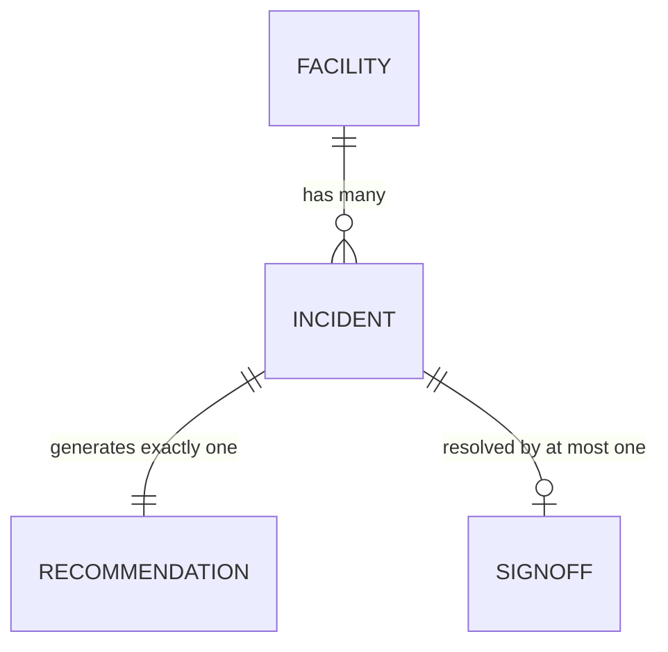

# SCHEMA.md — HealthNexus Command Center

**Day 52 of 60 · System Design**

## 1. Why This Is a Data Model, Not a Database Schema

Per the approved PRD (§4.2, Out of Scope), v1.0 has no real backend, database, or persistent storage. There is nothing to migrate, index, or query with SQL. What follows is the **client-side in-memory data model** — the shape every generator, component, and the sign-off gate reads and writes. If a real database is added post-v1.0, this model maps directly onto collections/tables with minimal translation (noted per-entity below).

## 2. Entities

### 2.1 Facility

| Field | Type | Constraint |
|---|---|---|
| `id` | string | Unique, format `fac_XX` |
| `name` | string | Synthetic, clearly fictional (never a real institution name) |
| `region` | string | e.g. "GCC — Synthetic", "US — Synthetic" |
| `bedCount` | integer | 50-800, generated |
| `baselineKPIs` | object | `{ mortalityIndex, infectionRate, avgLOS }` — synthetic floats |

**Future DB mapping:** `facilities` table/collection, `id` as primary key.

### 2.2 Incident

| Field | Type | Constraint |
|---|---|---|
| `id` | string | Unique, format `inc_XXXX` |
| `facilityId` | string | Foreign key → `Facility.id` |
| `unit` | string | e.g. "ICU", "L&D", "Med-Surg" |
| `type` | enum | `sentinel_event` \| `mortality_index` \| `infection_rate` |
| `severityTier` | enum | `Exceptional` \| `Strong` \| `Moderate` \| `Elevated` \| `High Risk` (High Risk = most severe) |
| `narrative` | string | Synthetic incident description |
| `trendContext` | string | e.g. "Up from Moderate 6 hours ago" |
| `timestamp` | ISO datetime | Generated relative to page load under seed |
| `status` | enum | `open` \| `resolved` — **derived**, true only via a valid `SignOff` (see §2.4) |

**Constraint enforced in code, not just data:** `status` cannot be set to `resolved` directly. It is computed as `signOff !== null`. This is the structural governance gate from PRD §5 (F5), implemented as a derived field rather than a settable one.

**Future DB mapping:** `incidents` table/collection, `facilityId` foreign key with `ON DELETE RESTRICT` (never cascade-delete an incident's facility silently).

### 2.3 Recommendation

| Field | Type | Constraint |
|---|---|---|
| `incidentId` | string | Foreign key → `Incident.id`, one-to-one |
| `recommendedAction` | string | Templated by type + severity |
| `rationale` | string | Templated explanation |
| `generatedAt` | ISO datetime | |
| `source` | enum | `synthetic_rule_engine` (v1.0) \| `claude_api` (future scope) |

**Critical constraint:** `Recommendation` is stored as its own object, never merged into `Incident` or `SignOff`. This is what makes the audit trail meaningful — the recommendation is frozen at generation time and never mutated.

### 2.4 SignOff

| Field | Type | Constraint |
|---|---|---|
| `incidentId` | string | Foreign key → `Incident.id`, one-to-one, nullable until signed |
| `signerName` | string | Synthetic clinician name |
| `signerRole` | string | e.g. "Chief Medical Officer", "Unit Medical Director" |
| `decision` | enum | `accepted` \| `modified` \| `rejected` |
| `decisionNote` | string | Required if `decision !== 'accepted'` |
| `timestamp` | ISO datetime | |
| `divergent` | boolean | **Derived**: `true` if `decision !== 'accepted'` — drives the divergence indicator in `ResolvedIncidents.jsx` |

**This is the single most important table in the product.** An `Incident.status` can only become `resolved` by a write to this entity. No other code path may set incident status.

## 3. Relationships

## 4. Validation Against Day 51 PRD User Stories

| PRD Requirement | Schema Support |
|---|---|
| F1 — system-wide queue ranked by severity | `Incident.severityTier` + `Facility` join for cross-facility sort |
| F2 — multi-facility drill-down | `Incident.facilityId` foreign key enables filter/group |
| F4 — AI-drafted recommendation, advisor role | `Recommendation` stored separately, never auto-applied to `Incident.status` |
| F5 — mandatory sign-off gate | `Incident.status` is derived from `SignOff` presence, not directly settable |
| F6 — resolved audit trail | `Recommendation` + `SignOff` both retained and displayable side by side, never overwritten |
| F7 — five-tier severity language | `Incident.severityTier` enum, exactly five values |

No gaps found. Schema is validated against every relevant Day 51 user story.
